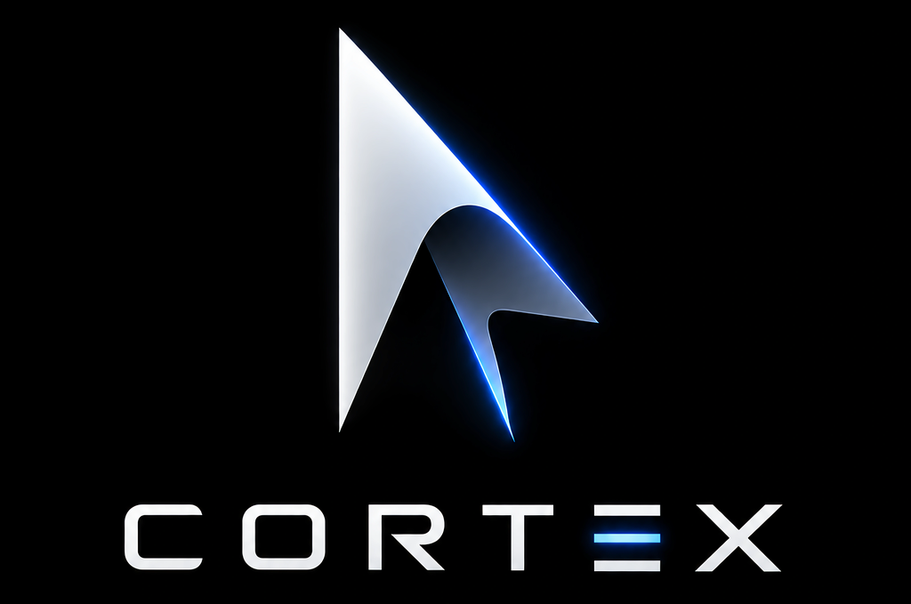

<h1 align="center">Cortex</h1>

<p align="center"></p>

<p align="center">A closed-loop computer-use MCP server for Windows — agents observe the screen, propose actions, and Cortex proves that each action did what it was supposed to do.</p>

<p align="center">
  <a href="LICENSE"></a>
  
  
</p>

## What is Cortex

Cortex is a Model Context Protocol (MCP) server that gives AI agents a safe, verifiable way to operate a Windows desktop. An agent connects over stdio and gets five deterministic tools — start a guarded session, capture the screen, execute a single action (click, double-click, drag, move, type, keypress, hotkey, scroll, wait, focus_window), take a raw screenshot, stop everything at any moment. Between the proposal and the physical input, Cortex runs a fixed pipeline: it grounds the action against a fresh observation, validates it (staleness, allowlists, coordinate integrity), classifies its risk, requests approval when policy requires it, and only then executes through a stop-checked backend.

After execution, Cortex re-observes the screen and verifies the action **semantically**: did the intended state transition actually occur? Every verification ends in an explicit outcome — `verified`, `failed`, or `uncertain` — and `uncertain` is never treated as success. The driving agent (the host) reads the outcome and re-drives from a fresh observation when a step fails — a moved window, an unexpected dialog, a stale screen are all surfaced as typed outcomes with evidence, never retried blindly inside the server.

The design principle: the goal is not to click the right pixel — it is to reach the intended state and prove that it happened. Every tool response carries an explicit outcome, and every session writes a redacted JSONL audit trail of every pipeline phase.

**As of 0.5.5 the internal autonomous loop is gone.** The `run_goal` tool family (`run_goal`, `create_subtask`, `list_subtasks`, `run_subtask`, `get_session_progress`) was removed by explicit user order: the server is driven exclusively by a host agent making direct tool calls with a real model, which halves the failure surface and removes the two loop-only defects (an unset vision key surfacing as an in-run HTTP 401, and unbounded screenshot text embedded in loop results). The five-tool surface is the whole contract; the loop's guarantees live on because every direct call passes through the identical grounding, validation, risk, approval, execution, and verification pipeline.

## How it works

```text
 start_session
      |
      v
 OBSERVATION --> GROUNDING --> VALIDATION --> RISK/AUTHORIZATION --> EXECUTION
 (screenshot +   (bind the     (staleness,     (contextual risk,      (stop-checked
  identity:       target to     allowlists,    approval gates,       physical input,
  monitor/DPI,    the screen)   coordinate     CRITICAL block)       100 ms wait
  window/process)               integrity)                           slices)
                                                                      |
      +---------------------------------------------------------------+
      |
      v
 RE-OBSERVE --> SEMANTIC VERIFICATION --(verified)--> next action --+
                    |                                               |
                    +--(failed / uncertain / typed refusal)--------> the HOST
                                                 re-observes, re-grounds, re-decides
                                                 (the driving agent; the server
                                                  never retries blindly)

 stop token / resource limits / approval gates --> FAIL SAFELY
 (every response carries an explicit typed outcome)
```

**Observation.** The backend captures the screen with `mss` and reads the foreground window's identity through Win32: `hwnd`, `pid`, process name, executable path, window class, title, and bounds. Each observation also carries per-monitor DPI, the cursor position, a fresh `observation_id`, a UTC timestamp, and a measured coordinate-space classification — `verified_passthrough`, `scaled`, or `unverifiable`. An `unverifiable` space refuses coordinate input outright; coordinates are never sent to the OS on a guess.

**State.** Each session owns a bounded `TaskState` (histories are capped deques), a thread-safe `StopToken`, a `LimitEnforcer` carrying nine hard limits, an audit logger, and a metrics registry. A registry caps concurrent sessions (default 4) and refuses new sessions fail-closed at capacity instead of evicting live ones.

**Grounding.** The grounding router binds the action's target to the screen. Coordinate grounding bounds-checks the point in screenshot space — both endpoints for a drag — and records the verified screenshot-to-input scale without ever rewriting the coordinate; the single scale transform is applied exactly once, in the backend, at execution. Region, text-anchor (OCR), and accessibility (UIA) strategies can derive a target when the data exists; OCR and UIA are currently extension points that refuse fail-closed when absent, and the pipeline degrades gracefully to coordinate grounding. Non-spatial actions (type, keypress, hotkey, scroll, wait, done, focus_window) ground trivially — they carry text, key names, or a window title instead of coordinates.

**Action validation.** Before anything executes, a second fresh observation is captured and the action is validated against it: screen bounds, confidence floor, window and process allowlists (process identity is authoritative; unknown identity while an allowlist is configured is a fail-closed rejection), and staleness. Coordinate actions bind to the observation they were grounded from; if the HWND, process, monitor, screenshot dimensions, or coordinate space drifted, the action is rejected (`STALE_OBSERVATION`). The direct path performs exactly one automatic re-observe + re-grounding on staleness before reporting the rejection — stale coordinates are never executed.

**Risk / authorization.** A contextual engine classifies every action `LOW` / `MEDIUM` / `HIGH` / `CRITICAL` from the action type, its text, the active window/process identity, and the goal. `HIGH` always requires approval; `CRITICAL` is blocked pending explicit authorization that nothing on screen and nothing the model says can provide; a high-risk action with unknown context escalates to `CRITICAL` (fail closed). Approval messages state the action, the target identity, the reason, the consequence, and how to approve.

**Execution.** The backend performs the physical input through PyAutoGUI. The stop token is checked before every input and between typed characters; waits are sliced at 100 ms so a stop lands within one slice; drags interpolate the stroke in segments and always release the mouse button, including on a mid-stroke stop. `focus_window` is the deliberate exception to PyAutoGUI: it drives the Win32 foreground switch directly (restore when minimized, then the standard `AttachThreadInput` foreground switch with an ALT-key nudge) and verifies that the foreground actually moved — a refusal is a typed `WindowFocusError`, never a silent success. Dry-run sessions validate the full pipeline but short-circuit before any input.

**Re-observe.** A fresh post-action capture is taken and returned with the result (as a real image block, or omitted with `include_screenshot_after=false` when the caller checks the verification verdict instead). PERF-004 rate-gate economics carry over to the direct surface: the `min_screenshot_interval_ms` rate gate (default 250 ms) protects FRESH observations — host-driven observes and the per-call grounding capture — while intra-call verification captures (the staleness probe, the post-action capture) are burst-exempt but still recorded, so session-wide capture volume stays enforced and bounded. The staleness check itself is digest-first: the grounding source's pixel digest is compared with the fresh pre-execution capture's digest (a pixel-identical capture proves identity drift impossible), and the full identity validation still decides — a digest mismatch is a hint, never a verdict.

**Semantic verification.** A chain of six strategies answers "did the intended transition happen?" with `verified` / `failed` / `uncertain`. The first definitive outcome wins; an all-uncertain chain combines into `uncertain`; no code path upgrades `uncertain` to success (asserted by a dedicated test). The comparison baseline is always the observation the action was grounded from. For model-judge intents a cheap-first ladder applies: deterministic window/process/text/predicate strategies derived from the action intent run first, the pixel-diff supporting check second, and the provider model judge ONLY when both cheap tiers are inconclusive — a deterministic verdict always skips the judge.

**Recovery.** Failures classify into a 12-value taxonomy and surface to the host as typed outcomes with evidence (the loop-era bounded auto-recovery was removed with the loop; the host drives retries from fresh observations — the same coordinates are never retried blindly). Authentication prompts always fail safely; credentials are never auto-typed.

**Fail safely.** Every refused call carries a typed outcome: grounding rejection (`reasons`), safety denial (policy message), approval request (`requires_approval`), limit exceeded, or a failed verification with evidence. On the five-tool surface success is always `ok: true` with a verification outcome the caller can trust; `uncertain` is reported honestly and is never success.

## Features

| | |
|---|---|
| **Closed-loop execution** | Every action is observed, grounded, validated, risk-checked, executed, re-observed, and semantically verified. |
| **Verifiable outcomes** | `verified` / `failed` / `uncertain` on every action; `uncertain` is never success. |
| **Staleness protection** | Coordinate actions bind to the observation they were grounded from; screen-identity drift refuses the action. |
| **Coordinate integrity** | Measured screenshot-vs-input classification (DPI-aware); unverifiable spaces refuse coordinate input. |
| **Contextual risk engine** | `LOW`/`MEDIUM`/`HIGH`/`CRITICAL` from action + context; approval gates and `CRITICAL` blocking. |
| **Typed failure outcomes** | 12-class failure taxonomy surfaced to the host; no blind coordinate retries, no auto-typed credentials. |
| **Kill switch** | Thread-safe stop token checked before every physical input; `stop_session` closes the session fail-closed. |
| **Audit trail** | Per-session JSONL with every phase event, redaction enforced at write time, 19 counters + 5 latency metrics. |
| **Secret redaction** | 10 detection patterns enforced on audit, provider payloads, and tool responses; secret-like typed text is blocked. |
| **Prompt-injection containment** | Five-channel prompt doctrine; screen text is untrusted data, never instructions or authorization. |
| **Hard resource limits** | 9 enforceable limits (task time, actions, model calls, screenshot rate, sessions) with fail-closed termination. |
| **Checkpoint resume** | Sealed, atomic checkpoints (HMAC-SHA256 integrity) with fail-closed resume through `start_session(resume_from_checkpoint=…)` — counters restored, never reset, budgets never enlarged. |
| **Benchmark scaffolding** | OSWorld-2.0-aligned task format plus a fake/env harness runner — harness only, no published scores. |

## Requirements

- **Windows 10, Windows 11, or Windows Server** with an active, interactive display session. Observation and input go through the real desktop; there is no headless mode.
- **Python 3.11 or newer.**
- **No vision endpoint required.** The five-tool server is fully deterministic — `computer_observe` + `computer_execute` call no model at all. The server-side vision provider configuration is retained only for host-driven `computer_execute` calls that opt into the model-judge verification tier (`model_visual`) via an `expected_effect` the cheap tiers cannot decide; a session works without it.

## Installation

From git:

```bash
pip install git+https://github.com/Xenos-ink/Cortex.git
```

Or from a clone, editable with the dev tools:

```bash
git clone https://github.com/Xenos-ink/Cortex.git
cd Cortex
py -3.11 -m venv .venv
.\.venv\Scripts\Activate.ps1        # Git Bash / WSL: source .venv/Scripts/activate
python -m pip install -e ".[dev]"
```

Verify the install:

```bash
python -c "import computer_use_mcp; print(computer_use_mcp.__version__)"
```

The package installs two console scripts, `cortex` and `computer-use-mcp`, which start the stdio MCP server. Running one blocks while it waits for MCP traffic on stdin — that is what a stdio server does; configure it in an MCP client instead of running it interactively (next section).

**Updating**

```bash
pip install --upgrade git+https://github.com/Xenos-ink/Cortex.git
```

or, from a clone:

```bash
git pull && python -m pip install -e ".[dev]"
```

### Install and update via an AI agent

You do not have to do any of this by hand. Paste one of the two prompts below into any AI coding agent (ZCode, Claude, Cursor, Kimi, Codex, …) and it will install or update Cortex for you end to end: prerequisites, venv, editable install, MCP wiring for the target host, verification, and a smoke test. Both prompts are self-contained — the agent asks you only for the two things it cannot know (where the repo comes from and which host to wire it into). Both prompts are written entirely in English so any agent can follow them verbatim.

#### Install prompt

````text
Your task: install the Cortex MCP server on this machine and wire it into the host application, from start to final verification. Do everything yourself; never ask the user to run any command manually. Ask the user at the start about two things only, if you do not already know them: (1) the repository source — download from GitHub (the default) or an existing local copy at a specific path? (2) which host application to wire the server into (ZCode, Claude Desktop, Cursor, or other). Everything else is fully specified in these instructions; you need no other context.

Step 1 — Check prerequisites:
- OS: Windows 10, Windows 11, or Windows Server with an active, interactive display session (there is no headless mode — capture and input go through the real desktop).
- Python 3.11 or newer: check with `py -3.11 --version` or `python --version`. If missing, install the latest 3.11+ from python.org before continuing.
- git is optional: needed only for the clone method; if it is absent, use the ZIP download.

Step 2 — Obtain the repository:
```bash
git clone https://github.com/Xenos-ink/Cortex.git
cd Cortex
```
If git is unavailable: download the ZIP from the repository page (Code → Download ZIP) and extract it. If the user gave you a local path to a copy, use it as is. Treat the full folder path as the reference value C:\path\to\Cortex and substitute it everywhere below (always use absolute paths in configuration files).

Step 3 — Virtual environment and installation:
```bash
py -3.11 -m venv .venv
.\.venv\Scripts\python.exe -m pip install -e .
```
- pyproject.toml at the repository root is the reference: the entry point is `computer_use_mcp.server:main`, the install creates the two console scripts `cortex` and `computer-use-mcp`, and the server also runs as a module via `python -m computer_use_mcp.server` — invent no other commands or flags.
- No optional extras are needed. Only if the user later asks for the development/test tooling: `.\.venv\Scripts\python.exe -m pip install -e ".[dev]"`.
- Verify the install succeeded:
```bash
.\.venv\Scripts\python.exe -c "import computer_use_mcp; print(computer_use_mcp.__version__)"
```

Step 4 — Wire the MCP server into the host application (both ways):
The standard server object is the same in every case (replace C:\path\to\Cortex with the real path, and use only the venv's python.exe):
```json
{
  "mcpServers": {
    "cortex": {
      "command": "C:\\path\\to\\Cortex\\.venv\\Scripts\\python.exe",
      "args": ["-m", "computer_use_mcp.server"],
      "cwd": "C:\\path\\to\\Cortex",
      "env": {
        "VISION_BASE_URL": "https://api.openai.com/v1",
        "VISION_MODEL": "your-vision-model",
        "VISION_API_KEY": "YOUR_API_KEY"
      }
    }
  }
}
```
Note: the whole `env` block is optional — the five-tool server is deterministic and needs no API key (the vision endpoint is only used by the model-judge verification tier when a call opts into it). If the user did not ask for it, drop `env` or leave it empty.

a) Global configuration (user level — applies to every project):
- ZCode: the file `%USERPROFILE%\.zcode\cli\config.json`, and the key there is `mcp.servers` (i.e. put the "cortex" object under `mcp.servers`, NOT under `mcpServers`; compatible fallback: `~\.agents\mcp.json` in the `mcpServers` shape above).
- Claude Desktop: the file `%APPDATA%\Claude\claude_desktop_config.json`, in the `mcpServers` shape as-is.
- Cursor: the file `%USERPROFILE%\.cursor\mcp.json`, in the `mcpServers` shape as-is.

b) Per-project / agent-level configuration (inside the target project folder):
- ZCode: `<project>\.zcode\config.json` with the key `mcp.servers` (compatible fallback: `<project>\.agents\mcp.json` in the `mcpServers` shape).
- Cursor: `<project>\.cursor\mcp.json` in the `mcpServers` shape.
- Claude Code: `<project>\.mcp.json` in the `mcpServers` shape.

Apply at least the method the user asked for; applying both (global + project) is recommended. If a config file already exists, merge the new "cortex" object into the existing `mcpServers`/`mcp.servers` without deleting any existing server. Respect JSON syntax strictly (double quotes, and doubled backslashes `\\` in Windows paths).

Step 5 — Verification:
- Restart the host application or reload its MCP connections, then confirm the tools list (tools/list) returns exactly the five Cortex tools: `start_session`, `computer_observe`, `computer_execute`, `stop_session`, `computer_screenshot` (a compatibility alias of `computer_observe`). The internal-loop family (`run_goal`, `create_subtask`, `list_subtasks`, `run_subtask`, `get_session_progress`) was REMOVED in 0.5.5 — if the host still lists any of them, it is running an older install.
- A secondary command-line boot check: run `.\.venv\Scripts\python.exe -m computer_use_mcp.server` — a stdio server stays waiting on stdin, which is normal; end it once it starts with no import errors, and treat tools/list from the host as the final proof.

Step 6 — Smoke test and notes:
- With the user's consent, run a short session: `start_session`, then `computer_observe`, then `stop_session`. As of the PERF-004 release the `dry_run` default is `false` (a live session that performs real input) — pass `dry_run: true` explicitly for a validation-only session with no input (its results carry the `DRY-RUN (no input dispatched):` banner). The `require_approval` default remains `true`.
- A missing `VISION_API_KEY` blocks nothing on the five-tool surface (`start_session`, `computer_observe`, `computer_execute`, `stop_session`); the key matters only for the model-judge verification tier, which raises a clear, typed error if a call actually needs it.
- Multi-monitor and DPI: coordinates are always given in screenshot space; the server measures per-monitor DPI and classifies the coordinate space; an unverifiable space refuses coordinate input fail-closed. Multi-monitor logic is unit-tested only — on a multi-monitor machine, start with a `dry_run: true` session to check the classification before any live input.
- If the tools do not appear: check the absolute path to `.venv\Scripts\python.exe` in the config and that the host was restarted after editing it; server logs go to stderr and per-session audit logs live under `%TEMP%\cortex\logs` (default level `LOG_LEVEL=INFO`).

When done: give the user a summary of the repository path, the config file(s) you edited, and the list of Cortex tools that appeared in the host.
````

#### Update prompt

````text
Your task: update an existing Cortex MCP server installation on this machine to the latest version with zero loss of data or settings. Ask the user only for the path of the current repository folder if you do not know it (the folder containing pyproject.toml for the computer-use-mcp package).

Step 1 — Check before anything: inside the repository folder run `git status --porcelain`. If local changes exist, destroy nothing and use no force `git reset`/`git checkout`: stash them safely with `git stash push -m "pre-update local changes"` and tell the user they can be restored later with `git stash pop`.
Step 2 — Fetch the new version: `git pull`. If the original install was not via git (a ZIP copy), re-download the latest ZIP and extract it over the copy while keeping the existing `.venv` folder.
Step 3 — Refresh dependencies: `.\.venv\Scripts\python.exe -m pip install -e .` (the same command as the original install; it re-resolves dependencies from the updated pyproject.toml).
Step 4 — Restart: restart the MCP connection in the host application (restart the app or reload the MCP servers) so the connection picks up the new version.
Step 5 — Re-verify: repeat the full verification — tools/list returns exactly the five Cortex tools (`start_session`, `computer_observe`, `computer_execute`, `stop_session`, `computer_screenshot`), then a short smoke test (`start_session` → `computer_observe` → `stop_session`).
Step 6 — Version ledger: read VERSIONS.md at the repository root and tell the user what changed in the new version and any Compatibility notes — pay special attention to default-value changes, such as `dry_run` now defaulting to `false` (a live session) as of the PERF-004 release.
Rollback if needed: if something breaks after the update, return to the previous version listed in VERSIONS.md with `git checkout <tag-or-commit>` then `.\.venv\Scripts\python.exe -m pip install -e .`, then restart the host.

When done: summarize the old and new versions (from pyproject.toml and VERSIONS.md), any local changes you stashed, and the final verification result.
````

## Running the server

```bash
python -m computer_use_mcp.server     # or just: cortex
```

Both entry points speak MCP over stdio: stdout carries the protocol, logs go to stderr, and per-session audit logs are written under `%TEMP%\cortex\logs` (override with `COMPUTER_USE_MCP_LOG_DIR`).

### MCP client configuration

A generic `mcpServers` block; the same shape works in Claude Code, ZCode, Cursor-style client configs. Adjust paths to your machine:

```json
{
  "mcpServers": {
    "cortex": {
      "command": "C:\\path\\to\\.venv\\Scripts\\python.exe",
      "args": ["-m", "computer_use_mcp.server"],
      "cwd": "C:\\path\\to\\Cortex",
      "env": {
        "VISION_BASE_URL": "https://api.openai.com/v1",
        "VISION_MODEL": "your-vision-model",
        "VISION_API_KEY": "${VISION_API_KEY}"
      }
    }
  }
}
```

The `env` block is optional — the five-tool server needs no API key (see the model-judge note above).

### Environment variables

| Variable | Purpose |
|---|---|
| `VISION_API_KEY` | API key for the vision provider (the model-judge verification tier only). **Lazy:** the server starts and every deterministic tool works without it; a missing key raises a typed, fail-closed error only if a call actually reaches the judge tier. |
| `OPENAI_API_KEY` | Fallback used when `VISION_API_KEY` is unset. |
| `VISION_BASE_URL` | OpenAI-compatible API base URL (default `https://api.openai.com/v1`). |
| `VISION_MODEL` | Multimodal model name (default `gpt-4.1-mini`). |
| `COMPUTER_USE_MCP_LOG_DIR` | Root directory for per-session audit logs (default `%TEMP%\cortex\logs`). |
| `COMPUTER_USE_MCP_CHECKPOINT_DIR` | Root directory for per-session long-running checkpoints (default `%TEMP%\computer-use-mcp\checkpoints`; one `checkpoint.json` per session). |
| `CORTEX_IMAGE_DELIVERY` | Default screenshot delivery for ALL sessions: `text` suppresses every outbound image block (full metadata only — non-vision-safe), `image` (or unset/garbage, fail-safe) keeps real image blocks. Overridden per session by `start_session(image_delivery=…)`. **Recommended `text` whenever the host's default model cannot view images** — see [Non-vision models](#non-vision-models). |
| `CORTEX_VALIDATE_REUSE_MS` | Freshness window (ms) for the mechanical-speed validate-reuse path: a direct `computer_execute` whose grounding capture was taken in the same tool call skips re-capturing the identical screen, guarded by a capture-free identity probe (monitors / foreground window / coordinate space — any drift reverts to the full capture + staleness rejection). Default `1500`; `0` restores a full validate capture on every action. Verification semantics unchanged on all values. |
| `CORTEX_INTERNAL_FRAME_REUSE` | `0` disables the internal mechanical-speed stashes (capture-time RGB frame on observations + identical-pixel PNG payload dedupe) — the pure legacy pipeline. Default on; the stashes are in-process only, never serialized, and byte-identical in every digest/verification consumer. |
| `CORTEX_PNG_COMPRESS_LEVEL` | Opt-in PNG encode/size trade for capture throughput: `0`–`9` PIL compress level (default unset = PIL's own level = the historical bytes). `1` measured ~21.6 ms vs ~27 ms per 1920×1080 frame at ~+45% size. Internal pipeline only; the outbound image budget (`CORTEX_RESULT_IMAGE_MAX_KB`, default 180 KB) is unaffected. |
| `CORTEX_CAPTURE` | Capture backend: `blt` (default, the GDI/BitBlt mss pipeline) or `dxgi` — pure-ctypes DXGI Desktop Duplication (~26–43 ms vs ~53–90 ms per 1920×1080 capture on the mission desktop, no new dependency). Any other value degrades to `blt`. Fail-open by contract: a duplication that cannot be created (RDP/protected session, a second live duplicator in the process) or fails mid-session (device lost, lock screen) permanently falls back to the mss path for the session — the fast path can only speed captures up, never fail one. Idle-desktop semantics: duplication yields a frame only when the compositor changed something; on timeout the last frame (still current) is returned, and a cold duplication's first frame is fetched with a one-shot ~60 ms retry. |
| `CORTEX_TEXT_PNG` | `1` keeps real PNG payloads in **text-delivery sessions** (`image_delivery="text"`), disabling the R-6 encode-skip: by default a text session's captures carry a deterministic raw-pixel key (`RAW:<sha256>;WxH`) instead of a lossless PNG nobody will ever see — the key serves the digest and staleness comparisons byte-faithfully (identical pixels → identical key) and verification keeps reading the capture-time RGB frame, so no verification semantics change. Default off (= fast keys in text sessions). |
| `LOG_LEVEL` | Server log level (default `INFO`). |

### Non-vision models (image delivery)

`computer_observe` / `computer_execute` deliver screenshots as real MCP `ImageContent` blocks by default — correct for vision-capable client models. A model that **cannot view images** cannot consume those blocks: its provider rejects the whole request (`400 … 'content' must be a string…`) the moment one image part enters the conversation, and the turn dies permanently because the image replays in history. Two layers prevent this:

- **Per session (model-taught):** the driving model passes `start_session(image_delivery="text")`. The `start_session` tool description teaches the model to judge by what it *receives* (text-only inputs → `text`, required) rather than by what it *thinks it is* — self-misclassification ("my host is multimodal") is the documented failure mode this wording targets. Text mode returns the full metadata payload (window, cursor, digest, OCR/UI elements, `text_summary`) and never an image block; it never crashes any model — a vision model in text mode merely loses the screenshot pixels. `image_delivery="image"` (or omitting the parameter) keeps real image blocks. Invalid values are rejected fail-closed (`invalid_image_delivery`) before any session exists. The mode is deliberately not checkpointed: a resumed session is governed by its own fresh call.
- **Deterministic (user-set, recommended when the host's default model lacks image input):** set `"CORTEX_IMAGE_DELIVERY": "text"` in the Cortex MCP server entry's `env` block (e.g. Kimi Code's `mcp.json` `env`). This makes every session text-mode by default regardless of model self-assessment, and a vision model can still override per session via the parameter (`param > env > default`). Unset or garbage values fail-safe to `image` — a typo can never blind sessions silently.

## Usage

### Integration pattern: host-driven direct control

**Direct control (the only pattern as of 0.5.5).** The driving agent calls `computer_observe` and `computer_execute` itself: observe, decide what to do, execute one action, read the verification result, repeat. You keep full control of every step and no vision API is needed — but every action still passes through grounding, staleness validation, the risk engine, the approval gate, and semantic verification. The autonomous `run_goal` loop was removed by explicit user order (see [What is Cortex](#what-is-cortex)); when the UI path is not known in advance, the host agent iterates over these tools — the same per-action guarantees apply, with the driving model doing the deciding.

### Tool reference

Cortex exposes exactly five MCP tools (`computer_screenshot` is a compatibility alias of `computer_observe`, making the wire surface five distinct names).

**`start_session(dry_run=False, require_approval=True, max_steps=30, max_retries_per_action=1, min_confidence=0.70, allowed_windows=None, allowed_processes=None, limits=None, resume_from_checkpoint=None, interference=None, image_delivery=None)`**

Creates a guarded session and returns the session state plus `allowed_processes`, the effective `limits`, and `task_id`. PERF-004 intentional default change: `dry_run` now defaults to **False** (live session) — the old `dry_run=True` default silently produced no-op sessions that cost a full agent turn to discover; pass `dry_run=True` explicitly for a validation-only session, and every dry-run result message starts with the unmistakable banner `DRY-RUN (no input dispatched):`. `require_approval` still defaults to True. `allowed_windows` is a window-title allowlist, `allowed_processes` a process allowlist (authoritative when the OS reports process identity; fail-closed when it does not; `focus_window` targets are checked against both allowlists before any foregrounding call). `limits` accepts any `Limits` field as a dict; unknown field names or non-numeric values are rejected. No API key is required. The trailing optional `resume_from_checkpoint` resumes a previous long-running session from a checkpoint file as a continuation — see [Resume](#resume). The trailing optional `image_delivery` ("image" (default) or "text") controls how screenshots are delivered by `computer_observe` / `computer_execute` — see [Non-vision models](#non-vision-models).

```json
{
  "dry_run": false,
  "require_approval": false,
  "max_steps": 30,
  "min_confidence": 0.7,
  "allowed_windows": ["Notepad"],
  "allowed_processes": ["notepad.exe"],
  "limits": { "max_actions": 50, "max_task_seconds": 300 }
}
```

**`computer_observe(session_id)`**

Captures the current screen and returns MCP content blocks: one `ImageContent` block carrying the screenshot itself (`image/png`) — so vision-capable client models receive a real image, not text — plus one `TextContent` block with the JSON metadata `{ "observation": ..., "digest": <sha256 of the screenshot payload>, "observation_id": ..., "active_app": ..., "image_format": "image/png", "text_summary": <PERF-004 additive one-line summary> }`. The additive `text_summary` line carries the active window title/process, cursor position, a focused-control hint when the backend supplies `ui_elements` (omitted gracefully when absent), and a changed/unchanged note versus the previous observation of this session. The `observation` object carries dimensions, cursor position, coordinate-space classification, monitor identity (bounds, primary flag, DPI scales), and the full window/process identity; the raw base64 never travels as text. Error paths still return the structured error dict. This explicit tool is not rate-gated — every capture writes an audit row, so hammering clients generate audit volume at their own discretion; the per-call grounding capture is the rate-gated path. `computer_screenshot(session_id)` is a compatibility alias returning the same blocks.

**`computer_execute(session_id, action, x=None, y=None, text=None, keys=None, delta=0, approved=False, expected_effect=None, x2=None, y2=None, target=None, include_screenshot_after=None, follow_ups=None)`**

Validates and executes one action through the full pipeline. Supported actions (there is deliberately no `key` and no `triple_click` action):

| Action | Parameters | Notes |
|---|---|---|
| `click` | `x`, `y` | screenshot coordinates |
| `double_click` | `x`, `y` | screenshot coordinates |
| `drag` | `x`, `y`, `x2`, `y2` | start and end point; both required, both screenshot coordinates; grounded and bounds-checked at both endpoints |
| `move` | `x`, `y` | hover the mouse — repositions the cursor, no click |
| `type` | `text` | up to 2000 chars, typed character-by-character with stop checks between characters |
| `keypress` | `keys` | list of up to 12 key names, e.g. `["ctrl", "s"]` |
| `hotkey` | `keys` | compound shortcut chord of 2-12 key names, e.g. `["ctrl", "s"]`; single-key presses stay on `keypress` |
| `scroll` | `delta` | -20..20 |
| `wait` | `delta` (seconds) | capped at 10 s, sliced at 100 ms so a stop lands immediately |
| `focus_window` | `target` | window title (max 200 chars); brings the matching window to the foreground |
| `done` | — | completion marker |

When either allowlist is configured (`start_session(allowed_processes=…)` / `allowed_windows=…`), a `focus_window` target is resolved and checked against **both** before any foregrounding call — the backend never runs on a disallowed target. Process allowlist: a target whose process is outside the list is refused (`process_not_allowed`), and so is a target that cannot be resolved (`process_identity_unavailable`). Window-title allowlist: a target whose title is outside the list is refused (`window_not_allowed`), and a target that cannot be resolved is refused there too (`window_identity_unavailable`). All four rejections are fail-closed.

Approval semantics: `approved=true` authorizes this one call when the policy requires approval (always for `HIGH` risk; for interactive actions when the session was started with `require_approval=true`). It never clears a `CRITICAL` block. `expected_effect` opts into semantic verification: the stated effect must be observed, or the result reports `failed`/`uncertain` — a stated effect turns "the screen changed somehow" into "the screen changed the way I claimed it would".

Possible outcomes: an executed result (`ok`, `action`, `message`, `verification`, plus `model_confidence`, `grounding_confidence`, `verification_confidence`), a grounding rejection (`ok: false` with `reasons`), a safety denial (`ok: false` with the policy message), or an approval request (`ok: false`, `requires_approval: true`, with the full approval message). An invalid action name or malformed payload returns `ok: false, error: "invalid_action"` whose message TEACHES the exact valid vocabulary and the closest valid shape for what was sent.

Interference Guard (T8, trailing optional): `interference` is a dict of policy sections for the session's Interference Guard — `focus_guard` (bound-target foreground verification; abort | refocus_then_abort | observe_only), `attach_or_launch` (`ensure_app` attach-before-launch doctrine; the server never launches by default), `dialog_sentinel` (modal-dialog interception with a control list; queued batches halt; `auto_handle` ships EMPTY — no automatic clicks), `focus_continuity` (keyboard-focus verification before/after dispatch; drift aborts or warns), `hotkey_guard` (pre-chord stuck-modifier sweep; abort or opt-in release). Every field is optional with protective defaults; unknown sections/fields are rejected fail-closed (`invalid_interference`). Events (`FOCUS_TAKEN_BY`, `MODAL_DIALOG`, `FOCUS_DRIFTED`, `TARGET_GONE`, `STUCK_MODIFIER`, ...) appear in `reasons` / `interference_events` / verification notes; see docs/ARCHITECTURE.md §16 and docs/SAFETY.md §11.10.

Host-payload opt-out (PERF-004, trailing optional): pass `include_screenshot_after=false` to omit the heavy `screenshot_after_base64` (~1-2 MB) from the response — recommended when you check the outcome via the verification verdict instead of the image (the full image stays available via `computer_observe`). Omitted or `null` keeps the legacy payload unchanged.

Queued actions (PERF-004, trailing optional): `follow_ups` accepts up to 5 action specs (same fields as the tool's action parameters). Each follow-up passes the FULL independent pipeline — grounding, validation, safety, approval semantics, execution, verification — exactly like a single action; the queue stops at the first verification failure, safety rejection, approval requirement, or post-action digest surprise (the screen changed since the queued premise was captured). Per-item results arrive in the additive `follow_up_results` field (bounded, no per-item screenshots) with `follow_ups_stopped_reason` (`null` = every item executed and verified). Batch small related groups and observe after the batch.

**`run_goal` — REMOVED (0.5.5, user order).** The autonomous loop tool and its family (`create_subtask`, `list_subtasks`, `run_subtask`, `get_session_progress`) no longer exist; the five tools above are the entire surface. The loop's per-action guarantees did not die with it — every `computer_execute` call runs the identical grounding, validation, risk, approval, execution, and verification pipeline, and returns the per-action result (action record, message, verification outcome and evidence) directly to the host. Successive goals are host-side loops of `computer_observe` → `computer_execute`; task completion is the host's decision, made on evidenced `verified` outcomes.

**`stop_session(session_id)`**

The kill switch. Arms the thread-safe `StopToken` — checked before every physical input, at every loop checkpoint, and inside waits — closes the session, and audits `stop` + `emergency_stop`. Every later tool call on that session id fails closed with `session_stopped`. Idempotent: stopping an already-stopped session returns a normal stop result. Nothing a model outputs can reach the stop setter; decisions are data, not control.

### How an agent benefits

**Verifiable state transitions instead of hoping.** A direct call returns the verification outcome and its evidence, not just "no exception". With `expected_effect`, the caller states what should change and the result answers whether it did. `ok: true` means evidence supported the claimed transition — and `ok: false` with `outcome: "uncertain"` means the runtime refuses to claim success it cannot back.

**Staleness protection.** The screen changed since the observation your coordinates came from — another window took focus, a dialog popped up? The action is refused (`STALE_OBSERVATION`) and the pipeline re-observes and re-grounds instead of clicking into whatever is now under those coordinates. Direct calls retry the re-observation once automatically before reporting a rejection.

**Focus before act.** Desktop input lands wherever the foreground is, and a stolen foreground is a real failure class in long web-application tasks (D365/ERP-style flows): a dialog or popup takes focus and the next click or keystroke silently hits the wrong window. `focus_window` brings a named window to the foreground before acting, so focus is established deliberately instead of assumed; `hotkey` covers compound native shortcuts (`ctrl+s` save, `ctrl+z` undo, and their dialog-driven kin) that are awkward or impossible to express as mouse sequences; `move` hovers without clicking, enabling hover affordances and tooltip reveal as deliberate, verifiable steps.

**Safety rails.** Every action is classified contextually before execution:

| Risk | Examples | Policy |
|---|---|---|
| `LOW` | typing plain text into an identified window; clicking an identified application; cursor moves (`move`, no click); scroll; wait | executes under the session's approval policy |
| `MEDIUM` | navigating to a URL; save-as / rename / file moves; state-changing keypresses (`ctrl`, `alt`, `win`, `delete`, `backspace`); compound hotkeys containing those same keys; focusing a window (`focus_window`, category `window_focus_change` — subsequent input could land in an unintended application); interacting with an unidentified target application | approval when the session requires it; window-identity drift demotes actions to at least MEDIUM |
| `HIGH` | installers; killing processes; system settings; elevation; network configuration; pasting credentials | **always** requires approval |
| `CRITICAL` | shell/command execution; registry writes; disk formatting; file deletion; destructive SQL; credential changes; disabling security controls; purchases and money transfers; sending email | **blocked** pending explicit authorization (no MCP tool grants it today — fail safe, and honest about it); a high-risk action with unknown window/process context escalates here |

**Audit evidence.** Every phase of every action — observation, grounding, validation, safety decision, approval, execution, verification — is appended to a per-session JSONL file with redaction enforced at write time. The session also tracks the metrics registry: counters (actions, verifications by outcome, safety blocks, approvals, screenshots) and latency summaries (observation, execution, verification) with count/avg/p50/p95/max, visible to tests and tooling through the bundle.

**Recovery without blind retries.** A moved window, an unexpected dialog, a blocked input, an app crash — each classifies into a named failure class and surfaces to the host as a typed outcome with evidence (a rejected stale click, a `InputBlockedError` action error, a `DisplayUnavailableError` root cause). The server never fires the same coordinates twice hoping the second click lands; the host re-observes and re-grounds. Authentication prompts fail safely; credentials are never typed.

**Secret redaction.** Ten detection patterns (AWS keys, JWTs, private-key blocks, bearer tokens, basic-auth URLs, password/token assignments, Luhn-validated card numbers) are enforced on the audit sink, the provider payload, and the tool responses. A `type` action whose text resembles a secret, credential, or destructive command is blocked before it reaches the backend.

**Prompt-injection containment.** The model prompt is five labeled channels: `USER INTENT`, `SYSTEM POLICY`, `TASK STATE` (authoritative), `MODEL SUGGESTION` (advisory), and `ENVIRONMENT CONTENT` (untrusted data). Screen-derived text enters only under `ENVIRONMENT CONTENT` — it is data about the screen, never instructions, never authorization. The policy instructs the model to report instruction-like screen content in a `suspicious_content` field instead of complying, and provider output is parsed into a fixed schema where every field is data: nothing in it can change policy, grant approval, or reach the stop token.

### Verification semantics

Every verification produces an outcome in `{verified, failed, uncertain}`:

- **`verified`** — a strategy found affirmative evidence that the intended transition occurred.
- **`failed`** — a strategy found affirmative evidence that it did not (expected text absent, screen pixel-identical when a change was required, window/process state mismatched).
- **`uncertain`** — no strategy could decide from the available data. `uncertain` is **never** success anywhere in the codebase — no code path maps it to `verified`, and this is asserted by a dedicated test. Failed and uncertain verifications are reported to the host in the response (`ok` reflects the outcome for direct calls with a stated effect). The single documented carve-out: a `wait` action tolerates `uncertain` with an audited note, because a wait makes no semantic claim about state.

Without a stated expectation, pixels alone stay ambiguous: an identical screen or a sub-threshold change yields `uncertain`, not a free success.

The six strategies in the default chain (first definitive outcome wins):

| Strategy | `verified` means | Without data |
|---|---|---|
| `deterministic_predicate` | a caller-supplied predicate returned `True` over (before, after) | no predicate → `uncertain` |
| `window_state` | the active window title (and/or bounds change) matches the stated expectation | no window identity → `uncertain` |
| `process_state` | the foreground process name (`.exe`-tolerant) and/or pid matches | no process identity → `uncertain` |
| `text_predicate` | the expected text appears in the OCR regions of the after-observation | no OCR → `uncertain` |
| `screenshot_diff` | pixels changed consistently with the stated expectation — mean pixel difference ≥ 1.0, **or** ≥ 50 strongly-changed pixels (per-channel delta ≥ 40), so compact changes such as thin strokes and small controls verify even when the screen-wide mean barely moves | decode failure → `uncertain` |
| `model_visual` | a configured vision judge (the OpenAI-compatible provider) confirmed the transition | no judge → `uncertain` |

The newer actions get deterministic intent defaults: `move` verifies through a deterministic cursor-position predicate — the after-observation's cursor must sit within ±2 px of the requested point on both axes; missing cursor data yields `uncertain`, never success. `focus_window` verifies through a deterministic window-state check against the requested target title (case-insensitive contains), never through pixels. `hotkey` verifies like `keypress`: `visual_change` by default, promoted to `window_state` when the stated effect opens/launches/switches to something ("open Notepad", "switch to Settings", …).

### Worked example

A realistic direct-control session: Notepad is open on the desktop; the agent starts a session, types a line, and stops. Field values are illustrative; field names and shapes are exact. Trailing `…` marks omitted content.

**1. Start a session — dry-run off, approval off, locked to Notepad:**

```json
// start_session
{
  "dry_run": false,
  "require_approval": false,
  "allowed_processes": ["notepad.exe"],
  "limits": { "max_actions": 50 }
}
```

```json
// response
{
  "session_id": "0f4ac21e5d8b4f0a9c3e77b2d1a6f5c8",
  "step_count": 0,
  "max_steps": 30,
  "max_retries_per_action": 1,
  "min_confidence": 0.7,
  "dry_run": false,
  "require_approval": false,
  "stopped": false,
  "allowed_windows": [],
  "pending_approval_token": null,
  "allowed_processes": ["notepad.exe"],
  "limits": "Limits(max_task_seconds=900.0, max_actions=50, max_retries_per_action=1, max_recovery_per_action=2, max_recovery_per_task=6, max_model_calls=60, min_screenshot_interval_ms=250, max_context_items=50, max_sessions=4)",
  "task_id": "9b1d…"
}
```

**2. Observe — check what is on screen and get the grounding identity:**

```json
// computer_observe { "session_id": "0f4a…" }  (response, trimmed — content blocks)
[
  { "type": "text", "text": "{
      \"observation\": {
        \"width\": 1920,
        \"height\": 1080,
        \"active_window\": \"Untitled - Notepad\",
        \"cursor_x\": 960,
        \"cursor_y\": 540,
        \"coordinate_scale_x\": 1.0,
        \"coordinate_space\": \"verified_passthrough\",
        \"observation_id\": \"c4d8e2a1…\",
        \"timestamp\": \"2026-09-05T12:00:00.123456Z\",
        \"monitor\": { \"id\": \"monitor-0\", \"index\": 0, \"bounds\": [0, 0, 1920, 1080], \"is_primary\": true, \"dpi_scale_x\": 1.0, \"dpi_scale_y\": 1.0 },
        \"active_window_info\": {
          \"hwnd\": 197216,
          \"pid\": 8123,
          \"process_name\": \"notepad.exe\",
          \"exe_path\": \"C:\\\\Windows\\\\System32\\\\notepad.exe\",
          \"window_class\": \"Notepad\",
          \"title\": \"Untitled - Notepad\",
          \"bounds\": [4, 4, 1024, 768]
        },
        \"ocr_text\": null,
        \"ui_elements\": null
      },
      \"digest\": \"3f7a…\",
      \"observation_id\": \"c4d8e2a1…\",
      \"active_app\": \"notepad.exe\",
      \"image_format\": \"image/png\"
    }"
  },
  { "type": "image", "data": "iVBORw0KGgoAAAANS…", "mimeType": "image/png" }
]
```

The screenshot arrives as a real `image` content block (visible to vision-capable client models); the text block carries only the grounding metadata — the raw base64 never travels as text. `ocr_text` and `ui_elements` are extension-point fields; without an OCR/UIA integration they stay `null` and the runtime grounds by coordinates.

**3. Type a line and state the expected effect — this is what drives semantic verification:**

```json
// computer_execute
{
  "session_id": "0f4a…",
  "action": "type",
  "text": "Hello from Cortex",
  "expected_effect": "the text 'Hello from Cortex' appears in the editor"
}
```

```json
// response
{
  "ok": true,
  "action": {
    "action": "type",
    "point": null,
    "to_point": null,
    "text": "Hello from Cortex",
    "keys": [],
    "delta": 0,
    "reason": "Explicit MCP action",
    "confidence": 1.0,
    "source_observation_id": null,
    "expected_effect": "the text 'Hello from Cortex' appears in the editor",
    "target": null,
    "action_id": "e5f2…",
    "risk": null,
    "grounding": {
      "strategy": "none",
      "confidence": 1.0,
      "evidence": ["Action type is non-spatial; grounding not required."],
      "normalized": false,
      "notes": "Trivial grounding for a non-spatial action; confidence is the decision's stated value."
    }
  },
  "message": "Executed type.",
  "verification": {
    "outcome": "verified",
    "changed": true,
    "note": "Visual state changed.",
    "confidence": 1.0,
    "evidence": [
      "Mean pixel difference 1.042500 (threshold 1).",
      "Strongly-changed pixels (delta >= 40): 1180 (change threshold 50)."
    ],
    "verification_method": "screenshot_diff",
    "observation_id": "7a11…",
    "verified": true
  },
  "screenshot_after_base64": "iVBORw0KGgoAAAANS…",
  "retry_count": 0,
  "model_confidence": 1.0,
  "grounding_confidence": 1.0,
  "verification_confidence": 1.0
}
```

What happened inside: the typed text was checked against OCR evidence first — none exists without an OCR integration, so the check honestly degraded to `uncertain` — and the documented fallback for direct calls then verified the deterministic visual change. The change was real, so the outcome is `verified` with the pixel evidence attached. Had nothing been typed (a blocked window, a swallowed keystroke), the screen would have stayed identical and the outcome would have been `failed`: "Expected change was not observed." The `risk` field on the action record stays `null`; the enforced risk decision (`low` — plain text into an identified target) lives in the safety audit event.

**4. Stop the session:**

```json
// stop_session { "session_id": "0f4a…" }
{
  "ok": true,
  "session_id": "0f4a…",
  "message": "Session stopped before the next action.",
  "task_id": "9b1d…",
  "termination_reason": null
}
```

From this point every tool call on that session id returns `{ "ok": false, "error": "session_stopped" }`. The session's full audit trail is on disk at `%TEMP%\cortex\logs\<session_id>\audit_<session_id>.jsonl`.

For a multi-step goal the host repeats step 3 (optionally interleaving `computer_observe` for fresh grounding) — the same grounding, validation, risk, approval, and verification machinery wraps every single call.

## Checkpoints and Resume

**As of 0.5.5 the subtask orchestration layer is gone with the loop** (`run_goal(auto_subtasks=…)`, `create_subtask`, `list_subtasks`, `run_subtask`, `get_session_progress` were all removed by user order). What survives — and remains fully supported — is the sealed checkpoint/resume machinery on `start_session`: a long-running host session can be stopped and later resumed as a continuation, with its budget counters intact.

### Checkpoints

Session state persists to disk so a session can be stopped and resumed:

- **Atomic**: the payload is serialized fully, written to a temp file, fsynced, then moved into place with `os.replace` — a reader never sees a partial file, and a failed write leaves the previous checkpoint intact.
- **Redacted**: every string value passes the redaction engine; if any value still looks secret-like after redaction, the write is **refused** (fail-closed). Checkpoints store no secrets and no screenshots.
- **Versioned**: `schema_version` gates loading; unknown/newer versions are rejected — never loaded best-effort. A corrupt checkpoint is rejected with a typed error; it is never deleted, repaired, or partially loaded.
- **Sealed**: every checkpoint carries an HMAC-SHA256 integrity seal over the tamper-sensitive state (session identity, goal, budget counters, limits, subtask states), keyed by a per-installation random key file (`.integrity_key`) under the checkpoint directory. Load verifies the seal before anything restores: tampered or unsigned checkpoints are refused, and a missing or replaced key refuses the resume — the load path never recreates the key.
- **Bounded, single file per session**: one `checkpoint.json` under the checkpoint directory (`COMPUTER_USE_MCP_CHECKPOINT_DIR`, default `%TEMP%\computer-use-mcp\checkpoints`), capped at 8 MB serialized.

Deterministic counter cross-checks at load time (defense in depth behind the seal): `budget.subtasks <= limits.max_subtasks` and `budget.steps <= limits.max_session_steps` — a sealed-but-forged counter past the checkpoint's own ceiling is refused. Counters with no deterministic ceiling (actions/model_calls) resume exactly as recorded, and the restored shared budget fails closed the moment any gated consumer runs — inflating counters grants no more work.

### Resume

`start_session(resume_from_checkpoint="<path to checkpoint.json>")` resumes a previous session as a **continuation**, not a new session:

- The checkpoint is loaded and fully validated (schema/version, structure, integrity seal); any defect is a typed refusal (`invalid_checkpoint` / `resume_refused`) — never a partial restore.
- Counters are **restored, never reset**: actions / model calls / steps / subtasks continue from the checkpoint values, and the elapsed-time anchor is re-based so wall-clock gaps cannot refill the duration budget.
- Limits are the checkpoint's own (re-clamped) limits — a resume can never enlarge the budget.
- The **current environment is re-verified** against the checkpoint's recorded expectations (foreground process and window, allowlists) before continuing; a mismatch — or missing current environment data — is a fail-closed refusal, and the freshly created session is discarded.
- The bounded context is restored under its stable identity.

The start response carries `resumed: true` and `continuation_of` (the original session id).

### Session resource limits

The `limits` dict on `start_session` carries the long-running session fields (validated and clamped fail-closed, like the per-task limits):

| Limit | Default | Clamp range | Meaning |
|---|---|---|---|
| `max_session_seconds` | 14400 (4 h) | 1..86400 | total wall-clock session duration (24 h max configurable) |
| `max_session_actions` | 2000 | 1..2000 | interactive actions across the session |
| `max_session_model_calls` | 500 | 1..500 | model calls across the session |
| `max_session_steps` | 500 | 1..500 | loop steps across the session |
| `max_subtasks` | 50 | 1..50 | subtask ceiling (checkpoint cross-check bound) |
| `context_summarize_every` | 25 | 1..500 | steps between context compressions |
| `health_check_interval` | 600 (10 min) | 60..3600 | minimum spacing between boundary health checks |

These are **shared session budgets**: everything the resumed session consumes is mirrored onto the session counters, which only ever grow. On resume the counters are restored from the checkpoint — never zeroed.

### Example: stop, then resume later

**1. Stop the session** — a `before_session_end` checkpoint is written before the kill path closes the session:

```json
// stop_session { "session_id": "0f4a…" }
```

**2. Resume later as a continuation** (counters return exactly as they were; the current environment must still match the checkpoint's expectations):

```json
// start_session
{ "resume_from_checkpoint": "C:\…\checkpoints\0f4a…\checkpoint.json" }
// → { "…", "resumed": true, "continuation_of": "0f4a…" }
```

The host then continues driving the session with `computer_observe` / `computer_execute` as usual — the resumed budget applies to everything it does.

### Backward compatibility

- The five tools (`start_session`, `stop_session`, `computer_screenshot`, `computer_observe`, `computer_execute`) keep their names, parameter positions, and response shapes.
- The removed loop family (`run_goal`, `create_subtask`, `list_subtasks`, `run_subtask`, `get_session_progress`) is gone from tools/list; hosts must drive actions directly — the documented pattern since the loop's guarantees (grounding, validation, risk, approval, verification) wrap every `computer_execute` call.
- No existing limit was removed or weakened; the session-level limits above are additive and clamped like the rest. A resume can never reset or enlarge a session counter.

## Testing

```bash
python -m pytest tests/ -q          # standard suite (E2E desktop tests auto-skip)
python -m ruff check src tests benchmarks

# Real-Windows E2E — drives live Notepad, Calculator, and Edge:
# PowerShell:  $env:CUMCP_RUN_E2E = "1"; python -m pytest tests/e2e/ -q
CUMCP_RUN_E2E=1 pytest tests/e2e/
```

Measured at HEAD on the development machine (Windows Server 2022, Python 3.12): **1195 passed, 7 skipped** for the standard suite (count moves with the in-flight mission-056 tree; the 7 skips are the gated real-Windows E2E desktop tests, skipped BY DEFAULT by the D6 fail-closed gate with a loud opt-in reason), and ruff reports **all checks passed**. `tests/e2e/` collects 10 tests: the 7 gated desktop tests (window identity, semantic typing verification, moved-window typed verification failure, foreground-switch staleness defense, grounded Calculator clicks, display-value verification, browser window-state verification) plus 3 benchmark-harness tests that run unconditionally in the standard suite. The desktop tests are deterministic — no vision model, no network — and cross-check runtime assertions against real Win32 state so the runtime cannot self-certify. Desktop-safety doctrine (D6): the e2e gate opens ONLY for the exact opt-in `CUMCP_RUN_E2E=1` (any other variable or value stays closed), and every e2e app instance is isolated by a run-unique window token so the suite can never attach to, type into, or close a window it did not launch itself (see `tests/e2e/README.md`).

## Benchmarks

`benchmarks/` contains measurement scaffolding only: 9 task definitions in an OSWorld-2.0-aligned task format (`benchmarks/tasks/*.yaml`) and a runner (`python -m benchmarks.runner`) with `--mode fake` (default; an in-memory desktop, no GUI needed) and `--mode env` (real applications on the local machine). **No scores are published.** Every harness artifact carries the disclaimer "Harness validation output — NOT benchmark scores.", and no benchmark number should be inferred from anything in the repository until a measured run with a real vision provider exists.

### Test run log

Nothing about a test goes unrecorded: after every scoring invocation, the harsh-task
scorer (`benchmarks/score_task.py`) **automatically** appends one record — UTC timestamp,
task, run id, driver/model label, wall time, reference timing, ratio, completed, precision,
actions, retries, guard events, anomaly count, notes — to two log files it owns:

- `benchmarks/runs-log.jsonl` — append-only, one JSON line per run (full history, never capped).
- `benchmarks/RUNS.md` — human-readable table, newest first (auto-generated; capped at the last 200 entries).

Label the driver/model with the free-text `--model` flag, e.g.
`python benchmarks/score_task.py --task <yaml> --run-record run.json --out scoring.json --model "glm-flash"`.
Pass `--no-log` to opt out; existing invocations keep working unchanged. The log is
pre-seeded with the maintainer's internal QA campaign rows (failed and invalidated
runs keep their honest labels). Deep per-run evidence for every row — run records,
scoring JSONs, bridge transcripts, screenshots — stays local to the maintainer's
machine and is not published; `benchmarks/RUNS.md` and `benchmarks/runs-log.jsonl`
are local-only (gitignored).

## Safety model

The threat model assumes three things: the model controls a desktop and is treated as a fallible, potentially manipulable proposer — never an authority; screen content is untrusted and can never grant permission; the vision provider sits outside the trust boundary and receives redacted payloads with no capabilities. On top of that: fail-closed defaults everywhere (unknown risk escalates to `CRITICAL`, unverifiable coordinate spaces refuse input, `uncertain` verification routes to recovery, malformed provider output is bounded recovery instead of a crash), bounded autonomy (approval budgets, recovery budgets, nine hard limits), and a redaction-enforced audit trail of every phase.

Full details — risk taxonomy with all pattern categories, fail-closed rules table, approval semantics, kill-path discipline, and the honest residual-risk list: **[docs/SAFETY.md](docs/SAFETY.md)**.

## Architecture

The module map with verified import graph, the pipeline-to-module mapping, the pinned data contracts (`Observation`, `GroundedAction` lineage, `VerificationResult`), the coordinate-transform invariant, the recovery taxonomy table, the stop-token enforcement story, the limits table, and the audit schema: **[docs/ARCHITECTURE.md](docs/ARCHITECTURE.md)**.

Planned work per upcoming version — the prioritized improvement backlog (P0/P1/P2, items R-01 … R-20): **[ROADMAP.md](ROADMAP.md)**.

## Limitations

- **Windows-first.** The execution backend targets Windows (PyAutoGUI + Win32). Non-Windows machines can import the package and run the test suite against in-memory fakes, but cannot drive a real desktop.
- **OCR and UIA are extension-point stubs.** No OCR engine or UIA integration ships. The text-anchor and accessibility grounding strategies refuse (fail-closed), and `text_predicate` verification degrades to `uncertain` — the pipeline degrades gracefully to coordinate grounding, but text-level grounding and verification need that integration built.
- **No OS-level sandboxing.** Policy, approval, and cancellation are enforced in-process. There is no VM, job object, or AppContainer isolation; if the process itself is compromised, these controls do not contain it, and the only physical backstop is the PyAutoGUI failsafe screen corner.
- **An interactive desktop session is required.** No headless mode; capture and input go through the real desktop.
- **Model-based verification is only as good as the configured provider.** A weak vision judge can produce wrong `verified` verdicts. Deterministic strategies run first in the chain, and a judge's `uncertain` is passed through, never upgraded.
- **Risk classification is pattern + context matching** (English patterns plus a small Arabic term set), not semantic understanding. Novel destructive phrasing in other languages may under-classify; the compensating controls are approval-by-default for interactive actions, allowlists, bounded recovery, and verification.
- **Screenshot secret redaction is partial.** Text-pattern redaction and explicit-region blur only; secrets visible purely as pixels are not detected.
- **Multi-monitor logic is unit-tested with fake monitor sets** (100/125/150% DPI); the reference E2E box is single-monitor, so real multi-monitor behavior is not E2E-verified.
- **The kill switch is cooperative and in-process.** `stop_session` guarantees no further input from this runtime; it is not an OS-level kill switch.

## Credits and references

### Research that informed the engineering design

Cortex does not include or redistribute code from any of these works. They informed the design thinking on verification, safety, and evaluation:

- OpenAI — [Computer-Using Agent](https://openai.com/index/computer-using-agent/)
- OpenAI — [Operator system card](https://openai.com/index/operator-system-card/)
- OSWorld: Benchmarking Computer Agents on Real Operating Systems ([arXiv:2404.07972](https://arxiv.org/abs/2404.07972))
- OSWorld 2.0 ([arXiv:2606.29537](https://arxiv.org/abs/2606.29537))
- ScreenSpot-Pro: GUI Grounding for Professional High-Resolution Computer Use ([arXiv:2504.07981](https://arxiv.org/abs/2504.07981))
- Agent S2: A Compositional Generalist-Specialist Framework for Computer Use Agents ([arXiv:2504.00906](https://arxiv.org/abs/2504.00906))
- UI-TARS: Pioneering Automated GUI Interaction with Native Agents ([arXiv:2501.12326](https://arxiv.org/abs/2501.12326))
- Agent S: An Open Agentic Framework that Uses Computers Like a Human ([arXiv:2410.08164](https://arxiv.org/abs/2410.08164))
- SeeClick: Harnessing GUI Grounding for Advanced Visual GUI Agents ([arXiv:2401.10946](https://arxiv.org/abs/2401.10946))
- CogAgent: A Visual Language Model for GUI Agents ([arXiv:2312.08914](https://arxiv.org/abs/2312.08914))

### Open-source libraries Cortex builds on

- [MCP Python SDK](https://github.com/modelcontextprotocol/python-sdk) (FastMCP server API)
- [pydantic](https://docs.pydantic.dev/)
- [Pillow](https://python-pillow.org/)
- [mss](https://github.com/BoboTiG/python-mss)
- [PyAutoGUI](https://pyautogui.readthedocs.io/)
- [httpx](https://www.python-httpx.org/)

## License

MIT — see [LICENSE](LICENSE). Copyright (c) 2026 Xenos-ink.
